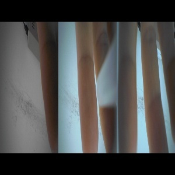

# Knuckles-Recognition
This project is aimed to use the image which is concatnated by three images token by three camera on the smart glass, and determine which knuckle is closest to the smart glasses. 

### Input Image
   

