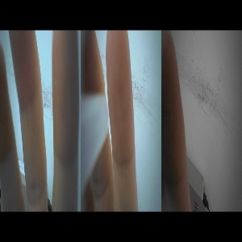
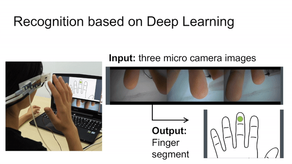

# Knuckles-Recognition
This project is aimed to use the image which is concatnated by three images token by three camera on the smart glass, and determine which knuckle is closest to the smart glasses. This could enable mid-air input for smart classes such as text-entrying or function selection. 

### Input Image
   
For example, the label of above image is "index_finger_1", where the "1" means it is the first knuckle of the index finger.

### Result Demo
   

### Single Camera
It's also possible to achieve knuckles-Recognition using single camera like the demo link below
https://www.youtube.com/watch?v=hllfWS1LgSk&feature=youtu.be&fbclid=IwAR21g11fcau748lfvHjAUe-dnBQHKKKRloLdvMhGN-X7jmA5F1z-CZCwSh4.
But it's unstable while the finger is too close to the camera.

